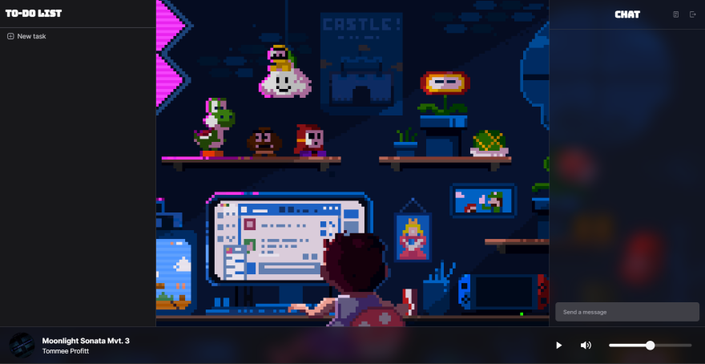

<div align="center">
  <a href="https://focusflow.vercel.app/">
    
  </a>
</div>

# FocusFlow

Listen to live radio, chat with other users, create tasks and stay focused with the Pomodoro technique all in one place. Increase your productivity and enjoy the best music and company with our platform.

## Project purpose

- Experiment monorepos with [PNPM Workspace](https://pnpm.io/workspaces)
- Learn how to deploy to [Fly.io](https://fly.io/)
- Front-End
  - Learn [Framer Motion](https://www.framer.com/motion/)
  - Learn [Socket.IO](https://socket.io/)
  - Practice [React](https://reactjs.org/)
  - Practice [Tailwind CSS](https://tailwindcss.com/)
  - Practice [Zustand](https://docs.pmnd.rs/zustand/getting-started/introduction)
  - Practice [React Query](https://tanstack.com/query/v4)
- Back-End
  - Learn [NestJS](https://nestjs.com/)
  - Learn [Socket.IO](https://socket.io/)
  - Practice [Prisma](https://www.prisma.io/)

## Getting Started

1. Clone the repo
    ```
    git clone git@github.com:joaom00/chat.git
    cd chat
    ```

2. Install dependencies
    ```
    pnpm install
    ```

3. Start the Postgres Database in Docker
    ```
    pnpm run docker
    ```

4. Run initial setup
    ```
    pnpm run setup
    ```

5. Run web and api applications
    ```
    pnpm run dev
    ```

Web will be running on port 3000 and API on 3333

## Acknowledgment
- [X-Team Radio](https://radio.x-team.com/)
